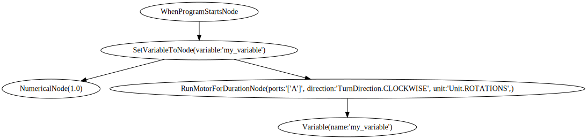

# Mindstorms Compiler

 ## How to use:

**Note:** This currently assumes you have some knowledge of working with Python and [Python](https://www.python.org) as well as [Pip](https://pypi.org) installed.

1. Download this repository.  
2. Download the necessary requirements for this project by running `pip install -r requirements.txt` in the root of the project.
3. Run the compiler by executing the following command in the root of the project `python -m src FILENAME` (where `FILENAME` is the path to the file that should be compiled).

## Description:

***Work in progress...***  

 A compiler from the [Scratch](https://scratch.mit.edu)-like programming language used by the [51515 Robot Inventor Lego set](https://www.lego.com/en-be/product/robot-inventor-51515) to Python.  
A great feature of the latest generation of Mindstorms is that they can be programmes using both a [Scratch](https://scratch.mit.edu)-like language (great for beginners) and [Python](https://www.python.org) (great for more experienced users). Sadly however making the switch from the Scratch-like language to Python can be a bit tricky as there is no way to generate the equivalent Python code for your past projects. This is where this program comes into play it takes as input your `project.lms` file and outputs the equivalent Python code.

 ### Structure:

 The root of the project contains a lot of uninteresting files which you can ignored unless you want to dive into the weeds how the project works.

 The source code can be found in `./src` this is a Python module which itself contains other Python modules the entry point is `./src/__main__.py` from which you should be able to follow the flow through all other files.

 The test can be found in `./tests` more precisely the input files for the tests are in `./tests/inputs` structured by the class of the blocks that are in the files. Each test input is a folder containing 3 files, the `FILE.lms` file with `FILE` the same name as the folder, the `project.json` this is the underlying json representation extracted from the the `FILE.lms` and `icon.scg` also extracted from the which in essence is a screenshot of the blocks that are in the project.  
 **Note:** If you save a file a `.lms` project file to `./tests/inputs` and run the `./format_input.sh` script on it it will automatically generate a folder with the same name as the file that will contain all 3 files discussed above.  
 The test themselves are written using [pytest](https://docs.pytest.org/en/7.2.x/) and are split into 3 categories, which test the JSON-extraction, AST-generation and Code-generation respectively. These can be run using `pipenv run pytest`.

 ### Already supported:

 The Abstract syntax tree generation of a number of blocks is already supported and tested. The AST also be visually represented using [Graphviz](https://graphviz.org). A simple example of such a visualization can be seen below.

